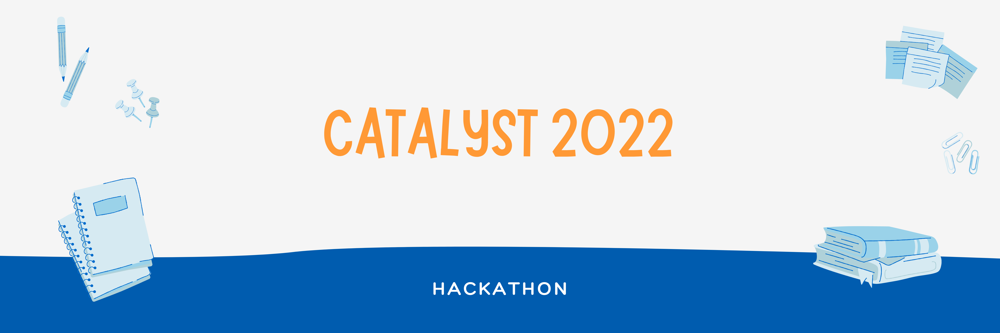

<h2> 💻 CATALYST 2022 </h2>
<a href="https://catalyst.zoho.com/hackathon.html">Catalyst Hackathon</a> is aimed to solve a critical business issue using Catalyst and win exciting prizes.

<h2> 🖥 PROJECT - CUSTOMER SUPPORT APPLICATION </h2>
Customer Support Application is basically a Web Craping Application intergrated with Text Analytics for Sentiment Analysis. Text Analytics is one of the services provided by the Catalyst Application. We use Catalyst's Text Analytics software to identify the customer grievance posted about a firm's product in the Web then use that information in hand to notify the customer support sector in that firm.

<h2> 📱 TECHNOLOGY STACK </h2>

